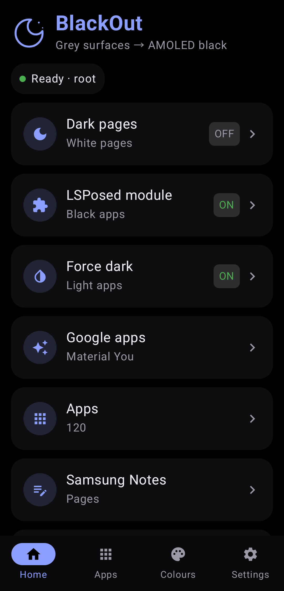
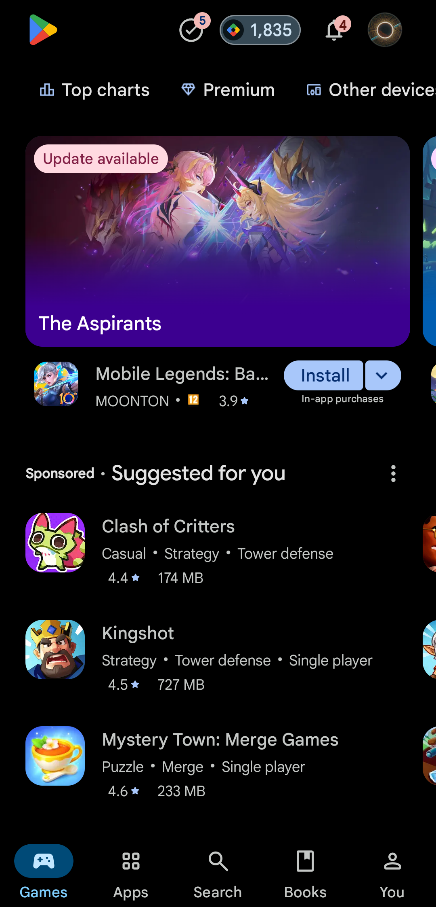
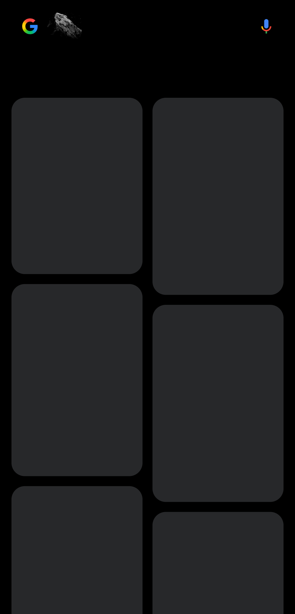
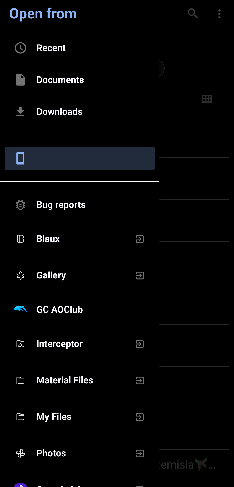

# BlackOut

Turns the grey surfaces of your apps into true black, for AMOLED screens.

Android's dark mode is dark grey (around `#121212`), not black. On an OLED panel, black pixels are switched off, so true black saves battery and looks deeper. BlackOut is a set of tools that push apps and pages the rest of the way to black, each with a different trade-off between how much it can do and what it needs.


## Screenshots

| Home | An app's page | Google, dark | Open from (file picker) |
|---|---|---|---|
|  |  |  |  |

## What you need

| Tool | Needs | What it does |
|---|---|---|
| **Dark pages** | Root or Shizuku | White pages turn the colour you choose (pure black by default). Text turns white. A live preview shows the result before you switch it on. |
| **LSPosed module** | Root and LSPosed | Every dark grey an enabled app asks for becomes black. Works even in apps that hide their colour names. Also home of the colour rules and force dark per app. |
| **Material You apps** | Root | Blackens the dark tones of Android's own palette, which Google apps build their surfaces from. |
| **Colours** | LSPosed module | Your own colour rules per app, made with the floating colour bar (see below). |

Most features are per app: open an app from the **Apps** tab, scan it, and pick what to change.

## The bottom bar

- **Home**: the tools above, and your root or Shizuku status.
- **Apps**: every app on the phone. Google and Samsung apps are listed first. Tap one for its settings.
- **Colours**: every app with colour rules, and the floating colour bar.
- **Settings**: grey limit, how much brightness is kept, root or Shizuku access, help, about.

## Colour rules

Some apps paint a white page or a light header in a colour that no setting covers. Colour rules fix that one colour at a time.

1. Open **Colours** and tap **Open the colour bar**. The app goes to the home screen and the bar stays on top of everything.
2. Open the app you want to change. Drag the ring over the colour you want to change. The bar shows the colour under the ring as `#RRGGBB`.
3. Tap the dot for the colour it should become (black, dark navy, dark grey or white), and the tolerance (±6% to ±30%) that decides how close a colour must be to match.
4. Tap **Save**. The rule is kept for that app, and the bar closes. Tap **✕** to close it without saving.

You can also add a rule by hand on an app's page: type a six-digit colour code, or tap **White → black** to add the common case in one tap.

Rules work inside the LSPosed module, so the app has to be restarted after a change. Dark text on a fill that turned dark turns light, so it stays readable.

The bar reads the colour with Android's accessibility screenshot (Android 11 and newer). It does not need root. It only reads the single pixel under the ring when you tap, and keeps nothing else.

## Force dark, per app

Android has its own dark rendering (the one behind **Override force dark** in Developer options). BlackOut can switch it on for one app, including apps that have no dark theme at all.

- It works with the LSPosed module. Tick the app in the module's list and restart it.
- It is not guaranteed. Some apps opt out of it, and some draw with their own graphics engine, which Android's dark rendering does not reach. YouTube, for example, already uses its own dark theme, and force dark can make it look worse.
- Android's force dark ends at about `#1C1C1C`, a dark grey. For a true black, add a colour rule for that grey.

If an app stays white, try a colour rule for its white page first. It is the more predictable of the two.

An app's page shows what the module is doing inside that app (is it running there, can it read BlackOut's settings, how many surfaces it changed). That tells you whether a problem is "not ticked in LSPosed" or "the app draws its own way".

## Samsung Notes and PDF readers

Swapping light and dark for the whole screen also flips Notes' own dark toolbars. **Dark pages, pages only** works inside the app instead: big light pictures (PDF pages, paper, ink layers) and large white areas swap, and the rest of the app stays as it is. It reaches what the app draws through Android's canvas. Anything an app paints with its own engine is out of reach, and then a colour rule is the next thing to try.

## Apps that hide their colours

Some apps strip their colour names from the resources, so the grey scan cannot tell their colours apart. For those, the LSPosed module still works, because it never looks at names. Pure black on the whole screen is also possible while that app is open (root only). BlackOut only watches which app is in front.

## Setting up the LSPosed module

1. In LSPosed, open **Modules**, then **BlackOut**, and switch it on.
2. Tick the apps you want, and tick BlackOut too, so the app can show "active".
3. Close those apps and open them again.

## Privacy

- No internet permission.
- The accessibility service learns which app is in front. The colour bar reads one pixel under the ring when you tap Save. Nothing is stored or sent.
- The app lists the installed apps on the phone so you can pick them. That list stays on the phone.

## Known limits

- Anything drawn by an app's own graphics engine (games, some PDF viewers, parts of Samsung Notes) cannot be recoloured by the module. Force dark and colour rules work only where the app uses Android's canvas or theme.
- Apps that opt out of force dark stay light, whatever you tick.
- Colour rules match exact colours within a tolerance, so a gradient or an image is not recoloured.
- Not every phone allows the accessibility screenshot. Android 11 or newer is needed.

## Build

```
python3 tools/make_stub.py   # builds the compile-only Xposed API stub
gradle assembleRelease
```

Kotlin and Jetpack Compose. Needs Android 12 or newer for the runtime overlays.

## Licence

Not chosen yet.

Made by [UmutK](https://github.com/xUmutKx).
