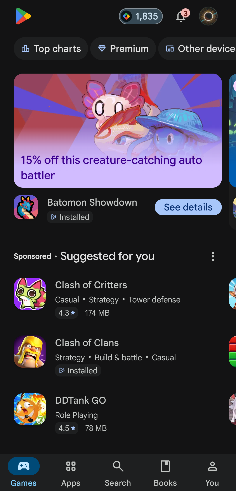

# BlackOut

Turns the grey surfaces of your apps into pure AMOLED black.

Android's dark mode is dark grey, not black. On an OLED screen that wastes the best thing the panel can do. BlackOut gives you four ways to fix it, from "no root, one tap" to "pure black in exactly the apps you choose".

> No data is shared. BlackOut has no internet permission: nothing you do here ever leaves your phone.

## Screenshots

| Home | An app's page | Google Play Store, blacked out |
|---|---|---|
|  |  |  |

## Pick a way

| | Needs | What it does |
|---|---|---|
| **Top layer** | Accessibility only | A see-through dark layer over everything, or only over the apps you pick. Greys get darker, white turns grey. |
| **Dark pages** | Root or Shizuku | White pages turn the colour you choose (AMOLED black by default), text turns white, photos keep their colours as far as a screen filter can. Live preview before you switch it on. |
| **LSPosed module** | Root + LSPosed | Every dark grey an enabled app asks for becomes pure black. Works even in apps that hide their colour names. |
| **Material You apps** | Root | Blackens the dark tones of Android's own palette, which Google apps build their surfaces from. |

There is also a per-app mode: scan an app, pick which of its grey colours to change, apply.

## Apps that hide their colours

Some apps strip their resource names, so overlays cannot tell their colours apart. For those, BlackOut can darken the whole screen only while that app is open (it watches which app is in front, nothing else), or you can use the LSPosed module.

## Setting up the LSPosed module

1. In LSPosed, open Modules → BlackOut and switch it on.
2. Tick the apps you want black, and tick BlackOut too, so the app can show "active".
3. Close those apps and open them again.

## Privacy

- No internet permission.
- The accessibility service only hears which app came to the front. It cannot read your screen, keys or text.
- The app lists your installed apps on the phone to let you pick; that list stays on the phone.

## Build

```
python3 tools/make_stub.py   # builds the compile-only Xposed API stub
gradle assembleRelease
```

Kotlin and Jetpack Compose. Needs Android 12 or newer (runtime overlays).

Made by [UmutK](https://github.com/xUmutKx).
